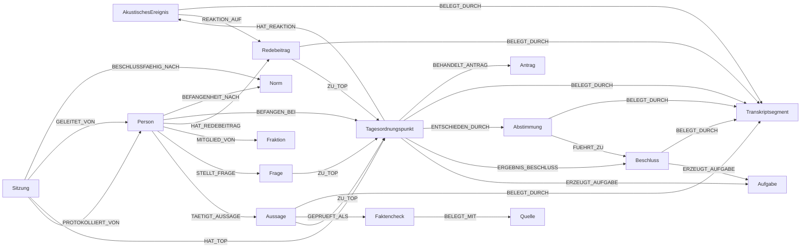

# Graph schema (Meta-Graph)

> **Generiert** aus 20 committeten Graphen (`web/data/*.json`) durch `scripts/graph_schema.py` am 2026-06-14. Nicht von Hand editieren — neu erzeugen. Vertrag/Format: [[spark-graph-format]]; Schichten: [[ontologie-5-schichten]]; Provenienz: [[provenienz-belegt-durch]].

## Knotentypen (Label)

| Typ (Neo4j-Label) | Schicht | Knoten (Σ) | Eigenschaften (außer id/label/type/subtype/schicht) |
| --- | --- | ---: | --- |
| `AkustischesEreignis` | fallbezug, reaktion | 11671 | herkunft, intensitaet, start_sec, text, urheber |
| `Redebeitrag` | fallbezug | 1739 | schriftlich, start_sec, text, timecode, video_url |
| `Person` | fallbezug | 1197 | dip_id, dip_url |
| `Aussage` | fallbezug | 798 | person, text |
| `Faktencheck` | faktencheck | 798 | begruendung, verdikt |
| `Quelle` | faktencheck | 717 | stand, url |
| `Transkriptsegment` | provenienz | 716 | audio_file, end_sec, sprecher, start_sec, text, timecode |
| `Tagesordnungspunkt` | prozedural | 169 | nummer |
| `Fraktion` | fallbezug | 80 | — |
| `Sitzung` | zeitlich | 20 | audio_file, beschlussfaehig, datum, gremium, ort, sitzung_nr, wahlperiode |
| `Norm` | normativ | 5 | — |
| `Aufgabe` | prozedural | 2 | frist, zustaendig |
| `Antrag` | prozedural | 2 | text |
| `Abstimmung` | prozedural | 2 | enthaltung, ergebnis, ja, nein |
| `Beschluss` | prozedural | 2 | nummer, text |
| `Frage` | prozedural | 1 | text |

## Beziehungstypen

| Beziehungstyp | Quelle → Ziel (beobachtet) | Kanten (Σ) | Eigenschaften |
| --- | --- | ---: | --- |
| `HAT_REAKTION` | Tagesordnungspunkt→AkustischesEreignis | 11671 | — |
| `REAKTION_AUF` | AkustischesEreignis→Redebeitrag | 11403 | — |
| `ZU_TOP` | Aussage→Tagesordnungspunkt; Frage→Tagesordnungspunkt; Redebeitrag→Tagesordnungspunkt | 2538 | — |
| `HAT_REDEBEITRAG` | Person→Redebeitrag | 1739 | — |
| `MITGLIED_VON` | Person→Fraktion | 1104 | — |
| `BELEGT_DURCH` | Abstimmung→Transkriptsegment; AkustischesEreignis→Transkriptsegment; Aussage→Transkriptsegment; Beschluss→Transkriptsegment; Redebeitrag→Transkriptsegment; Tagesordnungspunkt→Transkriptsegment | 964 | — |
| `TAETIGT_AUSSAGE` | Person→Aussage | 798 | — |
| `GEPRUEFT_ALS` | Aussage→Faktencheck | 798 | verdikt |
| `BELEGT_MIT` | Faktencheck→Quelle | 798 | — |
| `HAT_TOP` | Sitzung→Tagesordnungspunkt | 169 | — |
| `ERZEUGT_AUFGABE` | Beschluss→Aufgabe; Tagesordnungspunkt→Aufgabe | 2 | — |
| `BEHANDELT_ANTRAG` | Tagesordnungspunkt→Antrag | 2 | — |
| `ENTSCHIEDEN_DURCH` | Tagesordnungspunkt→Abstimmung | 2 | — |
| `FUEHRT_ZU` | Abstimmung→Beschluss | 2 | — |
| `ERGEBNIS_BESCHLUSS` | Tagesordnungspunkt→Beschluss | 2 | — |
| `STELLT_FRAGE` | Person→Frage | 1 | — |
| `BESCHLUSSFAEHIG_NACH` | Sitzung→Norm | 1 | — |
| `GELEITET_VON` | Sitzung→Person | 1 | — |
| `PROTOKOLLIERT_VON` | Sitzung→Person | 1 | — |
| `BEFANGEN_BEI` | Person→Tagesordnungspunkt | 1 | rechtsgrundlage |
| `BEFANGENHEIT_NACH` | Person→Norm | 1 | — |

## `metadata`-Felder (pro Graph)

| Feld | Typ(en) |
| --- | --- |
| `amtliches_pdf` | str |
| `amtliches_xml` | str |
| `clips` | int |
| `discovery` | str |
| `factcheck_disclaimer` | str |
| `generated_by` | str |
| `herkunft` | str |
| `mediathek_verlinkt` | int |
| `node_count` | int |
| `ontology_layers` | list |
| `pages_projektion` | str |
| `quelle_label` | str |
| `quelle_typ` | str |
| `quelle_url` | str |
| `relationship_count` | int |
| `source_audio` | str |
| `title` | str |
| `video_id` | str |

Beobachtete `herkunft`-Werte: {'amtlich': 13, 'youtube': 4}.

## Meta-Graph (Schema-Diagramm)

> Pflege-Hinweis: Neue Label/Beziehungen müssen in `NEO4J_SCHEMA` (`pipeline/neo4j_graphrag.py`, Text2Cypher) und im Web-`LAYER` gespiegelt werden (SPARK-Vertrag, ADR-0003). Diese Seite zeigt den IST-Zustand der Graphen, nicht den SOLL-Vertrag — Abweichung = Drift, bitte beheben.
